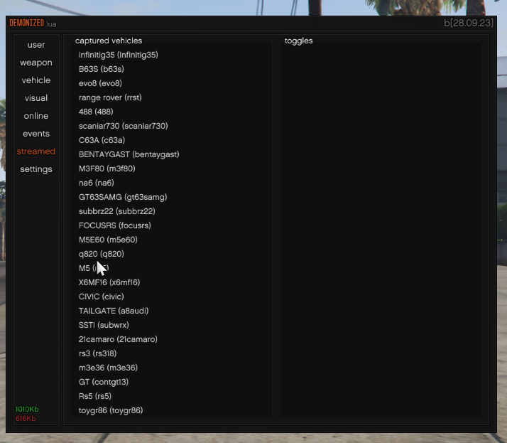

# DEMONIZED.lua
heavily modified version of [local_player.lua](https://github.com/nertigel/local_player.lua)

## Changelog

[ c08.02.25 ]
- "XOR" string - pretty much randomizes/scuffs all drawn strings to prevent ocr / screenshot text capture
- Added the option to reset a Slider back to it's default value by Right Click-ing it
- Added `disabled` statement to elements
- Added more models for Grenade ESP
- Added force crosshair
- Added voice proximity over-ride (with proximity slider)
- Removed the use of `FMMC_KEY_TIP1` for inputs

[ b08.10.23 ]
- Teleport to player.
- Rain vehicles on player.
- Explode player.
- Explode player using a vehicle.
- Force thirdperson.
- Force radar(minimap).
- Alarm on all vehicles.
- Always wheelie.

 Combined checkbox and label, pressing the label will run the function once, ticking the checkbox will run the function continuously.

[ b08.10.23 ]
- ESP entities are unsorted atm.
- Added core_crafting and esx_newDrugs dynamic triggers.
- Cause all peds to scream.
- Cause all peds to cough.
- Block legion square garage with props.
- Block pillbox hospital with props.
- Fixed ESP bounding box.
- Added player name filtering(for cleaner results in esp and menu).

(Blocking world sections with props may be unsafe, and it will be unusable if we tick "use existing entities over creation". Might be changed in the future, but not atm.)

[ b06.10.23 ]
- Resource list at settings tab, sorted by alphabetic order(A-z).
- Entities such as peds/vehicles at visuals are now sorted by distance.
- Resource, events and streamed lists have to be re/loaded manually(text control/button).
- Online players' list.
- screenshot-basic existence detection.

[ b28.09.23 ]
- 16 dynamic triggers(not including renamed duplicates).
- Optimized streamed tab.
- Use existing entities over creation(explanation: to reduce risk of getting caught by an event for creating an entity, we will use already existing networked entities).

[ b25.09.23 ]
- Resource initialization.
- Added dynamic triggers.
- Scrolling inside groupboxes.
- Events tab for dynamic triggers.
- Streamed tab for all addon vehicles.
